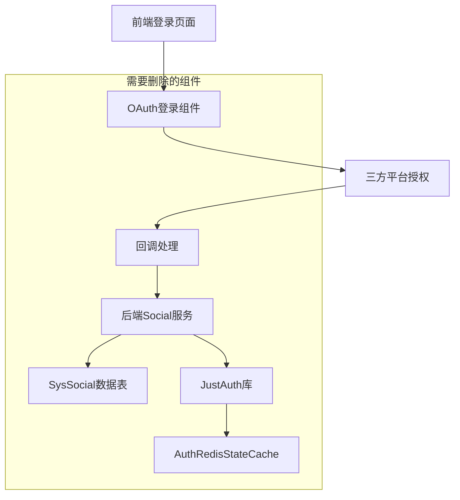
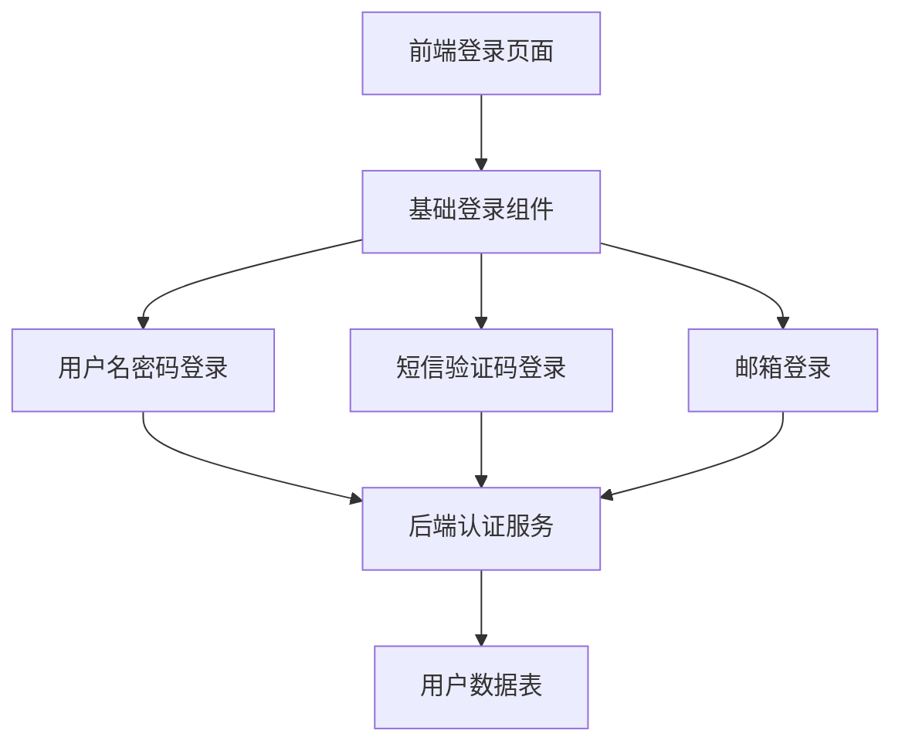

# 删除三方登录功能设计文档

## 概述

本设计文档详细描述了从Niko-Admin系统中完全移除三方登录功能的技术方案。该功能目前基于JustAuth库实现，支持微信、QQ、GitHub、Gitee等多种三方登录方式。删除过程需要涉及前端UI组件、后端服务、数据库表结构、Maven依赖等多个层面的清理工作。

## 架构

### 当前三方登录架构



### 删除后的简化架构



## 组件和接口

### 需要删除的后端组件

#### 1. niko-common-social模块
- **位置**: `niko-common/niko-common-social/`
- **功能**: 提供三方登录的核心功能和配置
- **主要类**:
  - `SocialAutoConfiguration`: 自动配置类
  - `SocialProperties`: 配置属性类
  - `SocialLoginConfigProperties`: 登录配置属性
  - `AuthRedisStateCache`: Redis状态缓存
  - `SocialUtils`: 工具类
  - 各种三方平台的Auth实现类

#### 2. 系统模块中的Social相关组件
- **SysSocial实体类**: `niko-modules/niko-system/src/main/java/org/niko/system/domain/SysSocial.java`
- **SysSocialBo**: 业务对象
- **SysSocialVo**: 视图对象
- **SysSocialMapper**: 数据访问层
- **ISysSocialService**: 服务接口
- **SysSocialServiceImpl**: 服务实现

#### 3. API接口
- **路径**: `/system/social/*`
- **主要接口**:
  - `GET /system/social/list`: 查询社交账号列表
  - `POST /system/social`: 新增社交账号绑定
  - `PUT /system/social`: 更新社交账号信息
  - `DELETE /system/social/{id}`: 删除社交账号绑定

### 需要删除的前端组件

#### 1. OAuth登录相关组件
- **oauth-login.vue**: `niko-ui/apps/web-antd/src/views/_core/authentication/oauth-login.vue`
- **social-callback**: `niko-ui/apps/web-antd/src/views/_core/social-callback/index.vue`
- **oauth-common.ts**: `niko-ui/apps/web-antd/src/views/_core/oauth-common.ts`

#### 2. 第三方登录UI组件
- **third-party-login.vue**: `niko-ui/packages/effects/common-ui/src/ui/authentication/third-party-login.vue`

#### 3. 个人中心账号绑定
- **account-bind.vue**: `niko-ui/apps/web-antd/src/views/_core/profile/components/account-bind.vue`

#### 4. API接口文件
- **social API**: `niko-ui/apps/web-antd/src/api/system/social/`

#### 5. 相关图标和资源
- **GithubOAuthIcon**: `niko-ui/packages/icons/src/iconify-offline/index.ts`
- 其他三方平台图标

### 需要修改的组件

#### 1. 登录页面
- **文件**: `niko-ui/apps/web-antd/src/views/_core/authentication/login.vue`
- **修改**: 移除对OAuthLogin组件的引用和显示

#### 2. 认证类型定义
- **文件**: `niko-ui/packages/effects/common-ui/src/ui/authentication/types.ts`
- **修改**: 移除'social'类型定义

## 数据模型

### 需要删除的数据表

#### sys_social表结构
```sql
create table sys_social
(
    id                 int8             not null,
    user_id            int8,
    tenant_id          varchar(20)      default '000000'::character varying,
    auth_id            varchar(255)     not null,
    source             varchar(255)     not null,
    open_id            varchar(255),
    user_name          varchar(30)      not null,
    nick_name          varchar(30)      default ''::character varying,
    email              varchar(255)     default ''::character varying,
    avatar             varchar(500)     default ''::character varying,
    access_token       varchar(255)     not null,
    expire_in          int8,
    refresh_token      varchar(255),
    access_code        varchar(255),
    union_id           varchar(255),
    scope              varchar(255),
    token_type         varchar(255),
    id_token           varchar(255),
    mac_algorithm      varchar(255),
    mac_key            varchar(255),
    code               varchar(255),
    oauth_token        varchar(255),
    oauth_token_secret varchar(255),
    create_dept        int8,
    create_by          int8,
    create_time        timestamp,
    update_by          int8,
    update_time        timestamp,
    del_flag           char             default '0'::bpchar,
    constraint "pk_sys_social" primary key (id)
);
```

### 数据迁移策略
由于删除sys_social表，需要考虑：
1. 备份现有数据（如果需要）
2. 检查是否有其他表引用sys_social
3. 清理相关的外键约束

## 错误处理

### 删除过程中的错误处理

#### 1. 编译错误处理
- **问题**: 删除组件后可能导致其他组件引用错误
- **解决**: 逐步删除，先注释引用，再删除文件

#### 2. 运行时错误处理
- **问题**: 配置文件中可能存在justauth相关配置
- **解决**: 清理所有相关配置项

#### 3. 数据库错误处理
- **问题**: 删除表时可能存在外键约束
- **解决**: 先检查依赖关系，再删除表

### 回滚策略
1. **代码回滚**: 使用Git版本控制进行代码回滚
2. **数据库回滚**: 保留数据库备份，必要时恢复
3. **配置回滚**: 备份原始配置文件

## 测试策略

### 单元测试
1. **后端测试**: 确保删除Social相关服务后，其他服务正常工作
2. **前端测试**: 确保登录页面正常显示，不包含三方登录选项

### 集成测试
1. **登录流程测试**: 验证用户名密码登录正常
2. **短信登录测试**: 验证短信验证码登录正常
3. **邮箱登录测试**: 验证邮箱登录正常

### 系统测试
1. **完整登录流程**: 从登录到系统使用的完整流程
2. **权限验证**: 确保用户权限系统正常工作
3. **个人中心**: 确保个人中心功能正常，不显示账号绑定

### 性能测试
1. **启动时间**: 确保删除组件后系统启动时间没有异常
2. **内存使用**: 验证内存使用情况
3. **响应时间**: 确保登录响应时间正常

## 配置清理

### Maven依赖清理
需要从以下文件中移除JustAuth相关依赖：
1. **niko-common/pom.xml**: 移除niko-common-social模块
2. **根pom.xml**: 检查是否有JustAuth相关依赖管理

### 配置文件清理
需要清理的配置项：
1. **justauth.type**: 三方登录类型配置
2. **justauth.***: 所有justauth前缀的配置项

### 自动配置清理
1. **SocialAutoConfiguration**: 删除自动配置类
2. **spring.factories**: 清理自动配置注册

## 部署注意事项

### 部署顺序
1. **数据库备份**: 备份sys_social表数据
2. **停止服务**: 停止应用服务
3. **更新代码**: 部署新版本代码
4. **数据库变更**: 删除sys_social表
5. **启动服务**: 启动应用服务
6. **功能验证**: 验证登录功能正常

### 回滚准备
1. **代码备份**: 保留当前版本代码
2. **数据库备份**: 保留完整数据库备份
3. **配置备份**: 保留原始配置文件

### 监控要点
1. **错误日志**: 监控应用启动和运行日志
2. **登录成功率**: 监控用户登录成功率
3. **系统性能**: 监控系统响应时间和资源使用

## 风险评估

### 高风险项
1. **用户体验**: 已绑定三方账号的用户可能无法登录
2. **数据丢失**: sys_social表数据永久丢失

### 中风险项
1. **编译错误**: 删除组件可能导致编译失败
2. **配置错误**: 遗留配置可能导致启动异常

### 低风险项
1. **性能影响**: 删除组件对性能影响较小
2. **功能影响**: 对核心业务功能影响较小

### 风险缓解措施
1. **充分测试**: 在测试环境充分验证
2. **分步实施**: 分阶段删除，降低风险
3. **快速回滚**: 准备快速回滚方案
4. **用户通知**: 提前通知用户功能变更