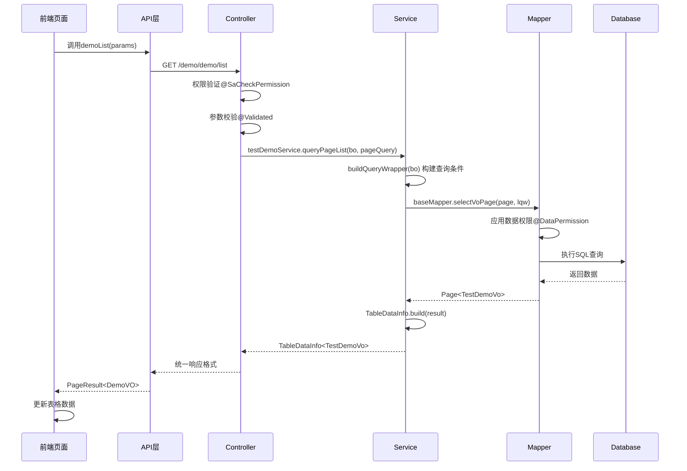
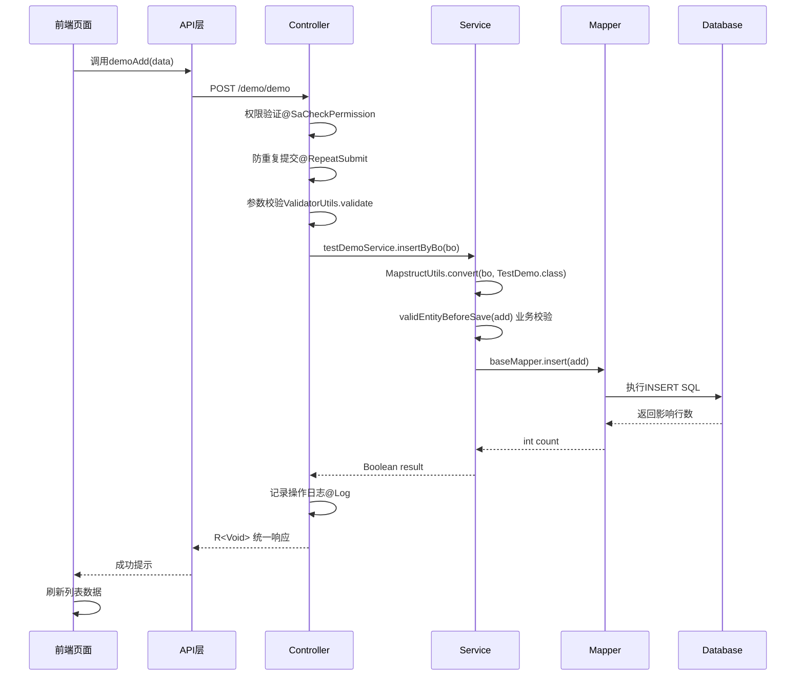
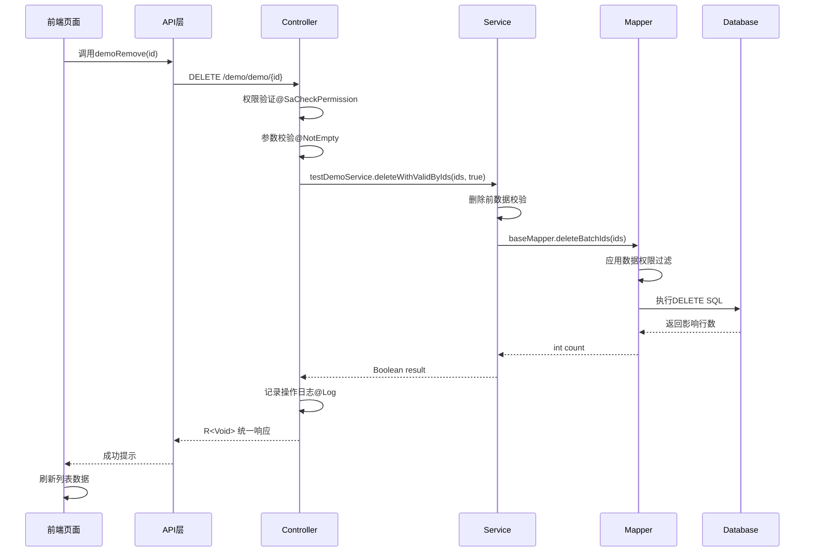

# Niko-Admin 前后端数据流转完整分析

## 概述

本文档详细分析了Niko-Admin系统中从前端页面到后端接口的完整数据处理流程，以demo模块为例，展示了Vue3前端与Spring Boot后端的集成架构。

## 系统架构概览

```
┌─────────────────┐    ┌─────────────────┐    ┌─────────────────┐
│   前端层 (Vue3)  │    │   后端层 (Java)  │    │   数据层 (DB)    │
├─────────────────┤    ├─────────────────┤    ├─────────────────┤
│ - 页面组件       │    │ - Controller     │    │ - PostgreSQL    │
│ - API调用       │    │ - Service        │    │ - Redis缓存     │
│ - 状态管理       │    │ - Mapper         │    │ - MinIO存储     │
│ - 路由控制       │    │ - Domain对象     │    │                 │
└─────────────────┘    └─────────────────┘    └─────────────────┘
```

## 1. 前端页面层 (Vue3 + Ant Design)

### 1.1 主页面组件

**文件位置：** `niko-ui/apps/web-antd/src/views/demo/demo/index.vue`

```vue
<script setup lang="ts">
import { demoList, demoRemove, demoExport } from './api';
import { columns, querySchema } from './data';

// 表格配置
const gridOptions: VxeGridProps = {
  columns,
  proxyConfig: {
    ajax: {
      query: async ({ page }, formValues = {}) => {
        return await demoList({
          pageNum: page.currentPage,
          pageSize: page.pageSize,
          ...formValues,
        });
      },
    },
  },
};

// 删除处理
async function handleDelete(row: Recordable<any>) {
  await demoRemove(row.id);
  await tableApi.query();
}
</script>
```

**关键特性：**
- 使用Vue3 Composition API和TypeScript
- 集成VxeTable实现表格数据绑定和分页
- 支持查询、新增、编辑、删除、导出等CRUD操作
- 响应式数据绑定和状态管理

### 1.2 表单和表格配置

**文件位置：** `niko-ui/apps/web-antd/src/views/demo/demo/data.ts`

```typescript
// 查询表单配置
export const querySchema: FormSchemaGetter = () => [
  {
    component: 'Input',
    fieldName: 'orderNum',
    label: '排序号',
  },
  {
    component: 'Input',
    fieldName: 'testKey',
    label: 'key键',
  },
];

// 表格列配置
export const columns: VxeGridProps['columns'] = [
  { type: 'checkbox', width: 60 },
  { title: '主键', field: 'id' },
  { title: '排序号', field: 'orderNum' },
  { title: 'key键', field: 'testKey' },
  { title: '值', field: 'value' },
  { title: '版本', field: 'version' },
  {
    field: 'action',
    fixed: 'right',
    slots: { default: 'action' },
    title: '操作',
  },
];
```

## 2. 前端API调用层

### 2.1 API接口定义

**文件位置：** `niko-ui/apps/web-antd/src/views/demo/demo/api/index.ts`

```typescript
import type { DemoForm, DemoQuery, DemoVO } from './model';
import { requestClient } from '#/api/request';

/**
 * 查询测试单表列表
 */
export function demoList(params?: DemoQuery) {
  return requestClient.get<PageResult<DemoVO>>('/demo/demo/list', { params });
}

/**
 * 新增测试单表
 */
export function demoAdd(data: DemoForm) {
  return requestClient.postWithMsg<void>('/demo/demo', data);
}

/**
 * 更新测试单表
 */
export function demoUpdate(data: DemoForm) {
  return requestClient.putWithMsg<void>('/demo/demo', data);
}

/**
 * 删除测试单表
 */
export function demoRemove(id: ID | IDS) {
  return requestClient.deleteWithMsg<void>(`/demo/demo/${id}`);
}

/**
 * 导出测试单表列表
 */
export function demoExport(params?: DemoQuery) {
  return commonExport('/demo/demo/export', params ?? {});
}
```

### 2.2 TypeScript类型定义

**文件位置：** `niko-ui/apps/web-antd/src/views/demo/demo/api/model.d.ts`

```typescript
// 视图对象 - 用于数据展示
export interface DemoVO {
  id: number | string;
  orderNum: number;
  testKey: string;
  value: string;
  version: number;
}

// 表单对象 - 用于新增/编辑
export interface DemoForm extends BaseEntity {
  id?: number | string;
  orderNum?: number;
  testKey?: string;
  value?: string;
  version?: number;
}

// 查询对象 - 用于列表查询和过滤
export interface DemoQuery extends PageQuery {
  orderNum?: number;
  testKey?: string;
  value?: string;
  version?: number;
  params?: any; // 日期范围等额外参数
}
```

## 3. 后端Controller接口层

### 3.1 控制器实现

**文件位置：** `niko-modules/niko-demo/src/main/java/org/niko/demo/controller/TestDemoController.java`

```java
@Validated
@RequiredArgsConstructor
@RestController
@RequestMapping("/demo/demo")
public class TestDemoController extends BaseController {

    private final ITestDemoService testDemoService;

    /**
     * 查询测试单表列表
     */
    @SaCheckPermission("demo:demo:list")
    @GetMapping("/list")
    public TableDataInfo<TestDemoVo> list(
        @Validated(QueryGroup.class) TestDemoBo bo, 
        PageQuery pageQuery
    ) {
        return testDemoService.queryPageList(bo, pageQuery);
    }

    /**
     * 获取测试单表详细信息
     */
    @SaCheckPermission("demo:demo:query")
    @GetMapping("/{id}")
    public R<TestDemoVo> getInfo(
        @NotNull(message = "主键不能为空") @PathVariable("id") Long id
    ) {
        return R.ok(testDemoService.queryById(id));
    }

    /**
     * 新增测试单表
     */
    @SaCheckPermission("demo:demo:add")
    @Log(title = "测试单表", businessType = BusinessType.INSERT)
    @RepeatSubmit(interval = 2, timeUnit = TimeUnit.SECONDS)
    @PostMapping()
    public R<Void> add(@RequestBody TestDemoBo bo) {
        ValidatorUtils.validate(bo, AddGroup.class);
        return toAjax(testDemoService.insertByBo(bo));
    }

    /**
     * 修改测试单表
     */
    @SaCheckPermission("demo:demo:edit")
    @Log(title = "测试单表", businessType = BusinessType.UPDATE)
    @RepeatSubmit
    @PutMapping()
    public R<Void> edit(@Validated(EditGroup.class) @RequestBody TestDemoBo bo) {
        return toAjax(testDemoService.updateByBo(bo));
    }

    /**
     * 删除测试单表
     */
    @SaCheckPermission("demo:demo:remove")
    @Log(title = "测试单表", businessType = BusinessType.DELETE)
    @DeleteMapping("/{ids}")
    public R<Void> remove(
        @NotEmpty(message = "主键不能为空") @PathVariable Long[] ids
    ) {
        return toAjax(testDemoService.deleteWithValidByIds(Arrays.asList(ids), true));
    }

    /**
     * 导出测试单表列表
     */
    @SaCheckPermission("demo:demo:export")
    @Log(title = "测试单表", businessType = BusinessType.EXPORT)
    @PostMapping("/export")
    public void export(@Validated TestDemoBo bo, HttpServletResponse response) {
        List<TestDemoVo> list = testDemoService.queryList(bo);
        ExcelUtil.exportExcel(list, "测试单表", TestDemoVo.class, response);
    }
}
```

### 3.2 关键注解说明

| 注解 | 作用 | 示例 |
|------|------|------|
| `@SaCheckPermission` | 权限验证 | `@SaCheckPermission("demo:demo:list")` |
| `@Validated` | 参数校验 | `@Validated(QueryGroup.class)` |
| `@RepeatSubmit` | 防重复提交 | `@RepeatSubmit(interval = 2)` |
| `@Log` | 操作日志 | `@Log(title = "测试单表", businessType = BusinessType.INSERT)` |

## 4. Service业务逻辑层

### 4.1 Service接口定义

**文件位置：** `niko-modules/niko-demo/src/main/java/org/niko/demo/service/ITestDemoService.java`

```java
public interface ITestDemoService {
    
    /**
     * 查询单个
     */
    TestDemoVo queryById(Long id);

    /**
     * 查询列表
     */
    TableDataInfo<TestDemoVo> queryPageList(TestDemoBo bo, PageQuery pageQuery);

    /**
     * 自定义分页查询
     */
    TableDataInfo<TestDemoVo> customPageList(TestDemoBo bo, PageQuery pageQuery);

    /**
     * 查询列表
     */
    List<TestDemoVo> queryList(TestDemoBo bo);

    /**
     * 根据新增业务对象插入测试单表
     */
    Boolean insertByBo(TestDemoBo bo);

    /**
     * 根据编辑业务对象修改测试单表
     */
    Boolean updateByBo(TestDemoBo bo);

    /**
     * 校验并删除数据
     */
    Boolean deleteWithValidByIds(Collection<Long> ids, Boolean isValid);
}
```

### 4.2 Service实现类

**文件位置：** `niko-modules/niko-demo/src/main/java/org/niko/demo/service/impl/TestDemoServiceImpl.java`

```java
@RequiredArgsConstructor
@Service
public class TestDemoServiceImpl implements ITestDemoService {

    private final TestDemoMapper baseMapper;

    @Override
    public TestDemoVo queryById(Long id) {
        return baseMapper.selectVoById(id);
    }

    @Override
    public TableDataInfo<TestDemoVo> queryPageList(TestDemoBo bo, PageQuery pageQuery) {
        LambdaQueryWrapper<TestDemo> lqw = buildQueryWrapper(bo);
        Page<TestDemoVo> result = baseMapper.selectVoPage(pageQuery.build(), lqw);
        return TableDataInfo.build(result);
    }

    /**
     * 构建查询条件
     */
    private LambdaQueryWrapper<TestDemo> buildQueryWrapper(TestDemoBo bo) {
        Map<String, Object> params = bo.getParams();
        LambdaQueryWrapper<TestDemo> lqw = Wrappers.lambdaQuery();
        lqw.like(StringUtils.isNotBlank(bo.getTestKey()), TestDemo::getTestKey, bo.getTestKey());
        lqw.eq(StringUtils.isNotBlank(bo.getValue()), TestDemo::getValue, bo.getValue());
        lqw.between(params.get("beginCreateTime") != null && params.get("endCreateTime") != null,
            TestDemo::getCreateTime, params.get("beginCreateTime"), params.get("endCreateTime"));
        lqw.orderByAsc(TestDemo::getId);
        return lqw;
    }

    @Override
    public Boolean insertByBo(TestDemoBo bo) {
        TestDemo add = MapstructUtils.convert(bo, TestDemo.class);
        validEntityBeforeSave(add);
        boolean flag = baseMapper.insert(add) > 0;
        if (flag) {
            bo.setId(add.getId());
        }
        return flag;
    }
}
```

## 5. 数据访问层 (Mapper)

### 5.1 Mapper接口

**文件位置：** `niko-modules/niko-demo/src/main/java/org/niko/demo/mapper/TestDemoMapper.java`

```java
public interface TestDemoMapper extends BaseMapperPlus<TestDemo, TestDemoVo> {

    /**
     * 自定义分页查询
     */
    @DataPermission({
        @DataColumn(key = "deptName", value = "dept_id"),
        @DataColumn(key = "userName", value = "user_id")
    })
    Page<TestDemoVo> customPageList(@Param("page") Page<TestDemo> page, @Param("ew") Wrapper<TestDemo> wrapper);

    /**
     * 重写查询方法，添加数据权限
     */
    @Override
    @DataPermission({
        @DataColumn(key = "deptName", value = "dept_id"),
        @DataColumn(key = "userName", value = "user_id")
    })
    default <P extends IPage<TestDemoVo>> P selectVoPage(IPage<TestDemo> page, Wrapper<TestDemo> wrapper) {
        return selectVoPage(page, wrapper, this.currentVoClass());
    }
}
```

### 5.2 MyBatis XML映射

**文件位置：** `niko-modules/niko-demo/src/main/resources/mapper/demo/TestDemoMapper.xml`

```xml
<?xml version="1.0" encoding="UTF-8" ?>
<!DOCTYPE mapper PUBLIC "-//mybatis.org//DTD Mapper 3.0//EN" "http://mybatis.org/dtd/mybatis-3-mapper.dtd">
<mapper namespace="org.niko.demo.mapper.TestDemoMapper">

    <select id="customPageList" resultType="org.niko.demo.domain.vo.TestDemoVo">
        SELECT * FROM test_demo ${ew.customSqlSegment}
    </select>

</mapper>
```

## 6. 数据对象设计 (Domain)

### 6.1 实体类 (Entity)

**文件位置：** `niko-modules/niko-demo/src/main/java/org/niko/demo/domain/TestDemo.java`

```java
@Data
@EqualsAndHashCode(callSuper = true)
@TableName("test_demo")
public class TestDemo extends TenantEntity {

    @Serial
    private static final long serialVersionUID = 1L;

    /**
     * 主键
     */
    @TableId(value = "id")
    private Long id;

    /**
     * 部门id - 用于数据权限控制
     */
    private Long deptId;

    /**
     * 用户id - 用于数据权限控制
     */
    private Long userId;

    /**
     * 排序号
     */
    @OrderBy(asc = false, sort = 1)
    private Integer orderNum;

    /**
     * key键
     */
    private String testKey;

    /**
     * 值
     */
    private String value;

    /**
     * 版本
     */
    private Integer version;
}
```

### 6.2 业务对象 (BO)

**文件位置：** `niko-modules/niko-demo/src/main/java/org/niko/demo/domain/bo/TestDemoBo.java`

```java
@Data
@EqualsAndHashCode(callSuper = true)
@AutoMapper(target = TestDemo.class, reverseConvertGenerate = false)
public class TestDemoBo extends BaseEntity {

    /**
     * 主键
     */
    @NotNull(message = "主键不能为空", groups = {EditGroup.class})
    private Long id;

    /**
     * 部门id
     */
    @NotNull(message = "部门id不能为空", groups = {AddGroup.class, EditGroup.class})
    private Long deptId;

    /**
     * 用户id
     */
    @NotNull(message = "用户id不能为空", groups = {AddGroup.class, EditGroup.class})
    private Long userId;

    /**
     * 排序号
     */
    @NotNull(message = "排序号不能为空", groups = {AddGroup.class, EditGroup.class})
    private Integer orderNum;

    /**
     * key键
     */
    @NotBlank(message = "key键不能为空", groups = {AddGroup.class, EditGroup.class})
    private String testKey;

    /**
     * 值
     */
    @NotBlank(message = "值不能为空", groups = {AddGroup.class, EditGroup.class})
    private String value;
}
```

### 6.3 视图对象 (VO)

**文件位置：** `niko-modules/niko-demo/src/main/java/org/niko/demo/domain/vo/TestDemoVo.java`

```java
@Data
@ExcelIgnoreUnannotated
@AutoMapper(target = TestDemo.class)
public class TestDemoVo implements Serializable {

    @Serial
    private static final long serialVersionUID = 1L;

    /**
     * 主键
     */
    @ExcelProperty(value = "主键")
    private Long id;

    /**
     * 部门id
     */
    @ExcelProperty(value = "部门id")
    private Long deptId;

    /**
     * 用户id
     */
    @ExcelProperty(value = "用户id")
    private Long userId;

    /**
     * 排序号
     */
    @ExcelProperty(value = "排序号")
    private Integer orderNum;

    /**
     * key键
     */
    @ExcelProperty(value = "key键")
    private String testKey;

    /**
     * 值
     */
    @ExcelProperty(value = "值")
    private String value;

    /**
     * 版本
     */
    @ExcelProperty(value = "版本")
    private Integer version;

    /**
     * 创建时间
     */
    @ExcelProperty(value = "创建时间", format = "yyyy-MM-dd HH:mm:ss")
    @DateTimeFormat("yyyy-MM-dd HH:mm:ss")
    private Date createTime;
}
```

## 7. 完整数据流转过程

### 7.1 查询流程



### 7.2 新增流程



### 7.3 删除流程



## 8. 架构特性分析

### 8.1 优势

1. **分层清晰**
   - 严格的分层架构，职责明确
   - 前后端分离，独立开发和部署
   - 易于维护和扩展

2. **安全性强**
   - 细粒度权限控制 (`@SaCheckPermission`)
   - 数据权限隔离 (`@DataPermission`)
   - 防重复提交保护 (`@RepeatSubmit`)
   - 参数校验和SQL注入防护

3. **开发效率高**
   - 代码生成器支持一键生成CRUD
   - 统一的响应格式和错误处理
   - 丰富的注解简化开发
   - TypeScript类型安全

4. **功能完善**
   - 支持多租户数据隔离
   - 操作日志自动记录
   - Excel导入导出
   - 国际化支持

### 8.2 潜在问题

1. **性能考虑**
   - 多层对象转换可能影响性能
   - 大量注解的运行时处理
   - 数据权限查询的复杂性

2. **学习成本**
   - 框架和注解较多，新人学习成本高
   - 需要理解Spring Boot、MyBatis Plus、Sa-Token等多个框架

3. **过度设计**
   - 对于简单CRUD可能显得繁重
   - 小型项目可能不需要如此复杂的架构

## 9. 最佳实践建议

### 9.1 开发规范

1. **命名规范**
   - Entity: 实体类，对应数据库表
   - BO: 业务对象，用于接收前端参数
   - VO: 视图对象，用于返回前端数据
   - API接口以业务名称命名

2. **分层职责**
   - Controller: 只负责参数校验和调用Service
   - Service: 处理业务逻辑和事务
   - Mapper: 只负责数据访问
   - 避免跨层调用

3. **异常处理**
   - 使用统一异常处理机制
   - 业务异常使用ServiceException
   - 返回友好的错误信息

### 9.2 性能优化

1. **查询优化**
   - 合理使用索引
   - 避免N+1查询
   - 使用分页查询大数据量

2. **缓存策略**
   - 字典数据使用Redis缓存
   - 热点数据适当缓存
   - 合理设置缓存过期时间

3. **对象转换**
   - 使用MapStruct进行对象转换
   - 避免在循环中进行复杂转换
   - 考虑使用对象池

## 10. 总结

Niko-Admin的前后端架构设计体现了现代企业级应用的最佳实践，通过严格的分层设计、完善的权限控制、丰富的功能特性，为开发团队提供了一个稳定、安全、高效的开发平台。

这套架构特别适合：
- 大型企业级应用开发
- 需要精细权限控制的系统
- 团队协作开发项目
- 对安全性要求较高的场景

开发者可以基于这套架构快速构建业务功能，同时也需要根据实际项目需求进行适当的裁剪和优化。