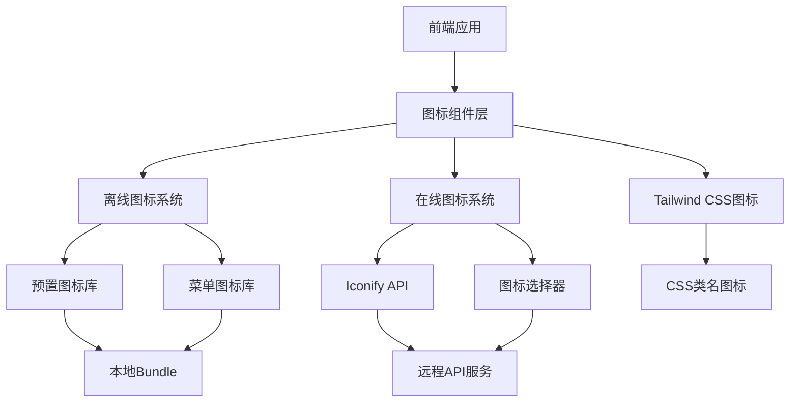

# Niko-Admin 前端图标系统完整分析

## 概述

Niko-Admin采用了基于Iconify的现代化图标管理系统，支持离线和在线混合模式，为企业级应用提供了灵活、高效的图标解决方案。本文档详细分析图标系统的架构设计、工作原理和使用方式。

## 1. 图标系统架构

### 1.1 整体架构图



### 1.2 核心特性

- **混合加载模式**：离线预置 + 在线动态加载
- **多种使用方式**：Vue组件、字符串标识符、CSS类名
- **类型安全**：完整的TypeScript支持
- **性能优化**：缓存机制、防重复请求、懒加载
- **可扩展性**：支持自定义图标集和图标服务器

## 2. 目录结构分析

### 2.1 核心文件结构

```
niko-ui/packages/icons/
├── src/
│   ├── iconify-offline/
│   │   ├── index.ts              # 离线图标注册中心
│   │   └── menu-icons.ts         # 菜单图标预加载
│   ├── iconify/
│   │   └── index.ts              # 在线图标组件
│   └── components/
│       └── icon/
│           └── icon.vue          # 统一图标组件
│
niko-ui/packages/effects/common-ui/src/components/
└── icon-picker/
    ├── icon-picker.vue           # 图标选择器组件
    ├── icons.ts                  # 图标数据获取API
    └── types.ts                  # 图标相关类型定义

niko-ui/packages/@core/ui-kit/shadcn-ui/src/components/icon/
└── icon.vue                      # 基础图标组件
```

### 2.2 依赖包结构

```json
{
  "dependencies": {
    "@iconify/vue": "5.0.0",           // Iconify Vue组件
    "@iconify/json": "2.2.334",        // 图标数据集
    "@iconify/tailwind": "1.2.0",      // Tailwind CSS集成
    "@ant-design/icons-vue": "7.0.1"   // Ant Design图标
  },
  "devDependencies": {
    // 30+个离线图标包
    "@iconify/icons-akar-icons": "^1.2.19",
    "@iconify/icons-ant-design": "^1.2.7",
    "@iconify/icons-arcticons": "^1.2.77",
    "@iconify/icons-bi": "^1.2.19",
    "@iconify/icons-carbon": "^1.2.20",
    // ... 更多图标集
  }
}
```

## 3. 离线图标系统

### 3.1 工作原理

离线图标系统通过预先导入图标数据并注册到Iconify本地缓存来实现。

**核心实现：** `packages/icons/src/iconify-offline/index.ts`

```typescript
import { addIcon } from '@iconify/vue';
import { defineComponent, h } from 'vue';
import type { IconifyIcon } from '@iconify/types';

// 创建离线图标组件的工厂函数
function createIconifyOfflineIcon(icon: string, iconComponent: IconifyIcon) {
  return defineComponent({
    name: `Icon-${icon}`,
    setup(props, { attrs }) {
      // 将图标数据注册到Iconify本地缓存
      addIcon(icon, iconComponent);
      return () => h(Icon, { icon, ...props, ...attrs });
    },
  });
}

// 预定义常用图标
export const UserOutlined = createIconifyOfflineIcon(
  'ant-design:user-outlined', 
  userOutlined
);

export const HomeOutlined = createIconifyOfflineIcon(
  'ant-design:home-outlined', 
  homeOutlined
);
```

### 3.2 离线图标库

系统预置了120+个常用图标，分为以下几类：

#### 3.2.1 系统功能图标
```typescript
// 用户相关
export const UserOutlined = createIconifyOfflineIcon('ant-design:user-outlined', userOutlined);
export const UserAddOutlined = createIconifyOfflineIcon('ant-design:user-add-outlined', userAddOutlined);
export const TeamOutlined = createIconifyOfflineIcon('ant-design:team-outlined', teamOutlined);

// 菜单导航
export const HomeOutlined = createIconifyOfflineIcon('ant-design:home-outlined', homeOutlined);
export const MenuFoldOutlined = createIconifyOfflineIcon('ant-design:menu-fold-outlined', menuFoldOutlined);
export const MenuUnfoldOutlined = createIconifyOfflineIcon('ant-design:menu-unfold-outlined', menuUnfoldOutlined);

// 操作功能
export const EditOutlined = createIconifyOfflineIcon('ant-design:edit-outlined', editOutlined);
export const DeleteOutlined = createIconifyOfflineIcon('ant-design:delete-outlined', deleteOutlined);
export const PlusOutlined = createIconifyOfflineIcon('ant-design:plus-outlined', plusOutlined);
```

#### 3.2.2 业务功能图标
```typescript
// 文件类型
export const ExcelIcon = createIconifyOfflineIcon('vscode-icons:file-type-excel', excelIcon);
export const PdfIcon = createIconifyOfflineIcon('vscode-icons:file-type-pdf2', pdfIcon);
export const WordIcon = createIconifyOfflineIcon('vscode-icons:file-type-word', wordIcon);

// 技术栈
export const RedisIcon = createIconifyOfflineIcon('logos:redis', redisIcon);
export const MysqlIcon = createIconifyOfflineIcon('logos:mysql', mysqlIcon);
export const PostgresqlIcon = createIconifyOfflineIcon('logos:postgresql', postgresqlIcon);
```

#### 3.2.3 菜单图标系统

**文件位置：** `packages/icons/src/iconify-offline/menu-icons.ts`

```typescript
import { addIcon } from '@iconify/vue';

// 批量注册菜单图标
const menuIcons = {
  'eos-icons:system-group': SystemGroup,
  'ph:user-duotone': UserDuotone,
  'ant-design:user-outlined': UserAntd,
  'ph:buildings-duotone': BuildingsDuotone,
  'ph:note-duotone': NoteDuotone,
  // ... 120+个菜单图标
};

// 批量注册到Iconify
Object.entries(menuIcons).forEach(([name, icon]) => {
  addIcon(name, icon);
});
```

### 3.3 离线图标的优势

1. **无网络依赖**：图标数据直接打包到bundle中
2. **加载速度快**：无需网络请求，即时显示
3. **稳定可靠**：不受外部API服务影响
4. **类型安全**：编译时图标名称检查

## 4. 在线图标系统

### 4.1 工作原理

在线图标系统通过Iconify API动态获取图标数据，支持海量图标集的使用。

**核心实现：** `packages/effects/common-ui/src/components/icon-picker/icons.ts`

```typescript
const ICONS_MAP: Record<string, string[]> = {};
const PENDING_REQUESTS: Record<string, Promise<string[]>> = {};

// 获取图标数据的核心函数
export async function fetchIconsData(prefix: string): Promise<string[]> {
  // 缓存检查
  if (Reflect.has(ICONS_MAP, prefix) && ICONS_MAP[prefix]) {
    return ICONS_MAP[prefix];
  }
  
  // 防重复请求
  if (Reflect.has(PENDING_REQUESTS, prefix) && PENDING_REQUESTS[prefix]) {
    return PENDING_REQUESTS[prefix];
  }
  
  const controller = new AbortController();
  
  // 创建API请求Promise
  const request = fetch(
    `https://api.iconify.design/collection?prefix=${prefix}`,
    { signal: controller.signal }
  )
  .then((res) => res.json())
  .then((response: IconifyResponse) => {
    const icons = Object.keys(response.icons || {});
    // 缓存结果
    ICONS_MAP[prefix] = icons;
    // 清除pending状态
    Reflect.deleteProperty(PENDING_REQUESTS, prefix);
    return icons;
  })
  .catch((error) => {
    // 错误处理
    Reflect.deleteProperty(PENDING_REQUESTS, prefix);
    throw error;
  });
  
  // 记录pending请求
  PENDING_REQUESTS[prefix] = request;
  return request;
}
```

### 4.2 图标选择器组件

**文件位置：** `packages/effects/common-ui/src/components/icon-picker/icon-picker.vue`

```vue
<template>
  <div class="icon-picker">
    <!-- 图标集选择 -->
    <Select v-model:value="selectedCollection" @change="handleCollectionChange">
      <SelectOption v-for="collection in collections" :key="collection.prefix" :value="collection.prefix">
        {{ collection.name }}
      </SelectOption>
    </Select>
    
    <!-- 搜索框 -->
    <Input 
      v-model:value="searchTerm" 
      :placeholder="$t('common.search')" 
      @input="handleSearch"
    />
    
    <!-- 图标网格 -->
    <div class="icon-grid">
      <div 
        v-for="icon in filteredIcons" 
        :key="icon"
        :class="['icon-item', { active: selectedIcon === `${selectedCollection}:${icon}` }]"
        @click="handleIconSelect(`${selectedCollection}:${icon}`)"
      >
        <Icon :icon="`${selectedCollection}:${icon}`" />
        <span class="icon-name">{{ icon }}</span>
      </div>
    </div>
    
    <!-- 分页 -->
    <Pagination 
      v-model:current="currentPage"
      :total="totalIcons"
      :page-size="pageSize"
      @change="handlePageChange"
    />
  </div>
</template>

<script setup lang="ts">
import { fetchIconsData } from './icons';

// 获取图标数据
const loadIcons = async (prefix: string) => {
  try {
    loading.value = true;
    const icons = await fetchIconsData(prefix);
    allIcons.value = icons;
    filterIcons();
  } catch (error) {
    console.error('Failed to load icons:', error);
    // 降级到离线模式
    allIcons.value = getOfflineIcons(prefix);
  } finally {
    loading.value = false;
  }
};
</script>
```

### 4.3 支持的图标集

系统支持130+个图标集，包括：

- **Material Design Icons (mdi)** - 7000+图标
- **Ant Design Icons (ant-design)** - 800+图标  
- **Bootstrap Icons (bi)** - 1600+图标
- **Carbon Icons (carbon)** - 2000+图标
- **Feather Icons (feather)** - 280+图标
- **Heroicons (heroicons)** - 460+图标
- **Tabler Icons (tabler)** - 4000+图标
- **Font Awesome (fa)** - 2000+图标

## 5. 统一图标组件

### 5.1 基础图标组件

**文件位置：** `packages/@core/ui-kit/shadcn-ui/src/components/icon/icon.vue`

```vue
<template>
  <!-- Vue组件图标 -->
  <component :is="icon as Component" v-if="isComponent" v-bind="$attrs" />
  <!-- 远程图片图标 -->
  
  <!-- Iconify字符串图标 -->
  <IconifyIcon v-else-if="icon" v-bind="$attrs" :icon="icon as string" />
  <!-- 默认回退图标 -->
  <IconDefault v-else-if="fallback" v-bind="$attrs" />
</template>

<script setup lang="ts">
import type { Component } from 'vue';
import { Icon as IconifyIcon } from '@iconify/vue';

interface Props {
  icon?: Component | string;
  fallback?: boolean;
}

const props = withDefaults(defineProps<Props>(), {
  fallback: false,
});

// 判断是否为Vue组件
const isComponent = computed(() => {
  return typeof props.icon === 'object' && props.icon !== null;
});

// 判断是否为远程图片
const isRemoteIcon = computed(() => {
  return typeof props.icon === 'string' && /^https?:\/\//.test(props.icon);
});
</script>
```

### 5.2 使用方式

#### 5.2.1 Vue组件方式
```vue
<template>
  <!-- 离线图标 -->
  <UserOutlined />
  <EditOutlined />
  
  <!-- 统一图标组件 -->
  <Icon :icon="UserOutlined" />
  <Icon icon="ant-design:user-outlined" />
</template>

<script setup lang="ts">
import { UserOutlined, EditOutlined } from '@vben/icons';
</script>
```

#### 5.2.2 字符串标识符方式
```vue
<template>
  <!-- Iconify字符串格式：图标集:图标名 -->
  <Icon icon="mdi:home" />
  <Icon icon="ant-design:user-outlined" />
  <Icon icon="heroicons:academic-cap" />
</template>
```

#### 5.2.3 远程图片方式
```vue
<template>
  <!-- HTTP/HTTPS图片链接 -->
  <Icon icon="https://cdn.example.com/icon.svg" />
  <Icon icon="https://api.iconify.design/mdi/home.svg" />
</template>
```

## 6. Tailwind CSS图标集成

### 6.1 配置方式

**文件位置：** `internal/tailwind-config/src/index.ts`

```typescript
import { addDynamicIconSelectors } from '@iconify/tailwind';

export function createTailwindConfig(options: TailwindConfigOptions = {}) {
  return {
    // ... 其他配置
    plugins: [
      // 添加Iconify动态图标选择器
      addDynamicIconSelectors(theme, {
        // 配置选项
        prefix: 'icon',
        scale: 1,
        // 自定义图标集
        iconSets: {
          'custom': '/path/to/custom-icons.json'
        }
      }),
      // ... 其他插件
    ]
  };
}
```

### 6.2 使用方式

```html
<!-- 基础用法 -->
<span class="icon-[mdi--home]"></span>
<span class="icon-[ant-design:user]"></span>

<!-- 带尺寸 -->
<span class="icon-[mdi--home] w-6 h-6"></span>
<span class="icon-[heroicons:academic-cap] text-2xl"></span>

<!-- 带颜色 -->
<span class="icon-[mdi--home] text-blue-500"></span>
<span class="icon-[ant-design:user] text-red-600"></span>

<!-- 响应式 -->
<span class="icon-[mdi--home] w-4 h-4 md:w-6 md:h-6"></span>
```

### 6.3 优势特点

1. **CSS原生**：无需JavaScript，纯CSS实现
2. **体积小**：只打包使用到的图标
3. **性能好**：无运行时开销
4. **灵活性**：支持Tailwind所有工具类

## 7. 性能优化策略

### 7.1 缓存机制

```typescript
// 图标数据缓存
const ICONS_CACHE = new Map<string, IconifyIcon>();

// API响应缓存
const API_CACHE = new Map<string, Promise<any>>();

// 本地存储缓存
const STORAGE_KEY = 'iconify-cache';
const CACHE_EXPIRY = 24 * 60 * 60 * 1000; // 24小时

class IconCache {
  // 获取缓存数据
  get(key: string): IconifyIcon | null {
    const cached = localStorage.getItem(`${STORAGE_KEY}:${key}`);
    if (!cached) return null;
    
    const { data, timestamp } = JSON.parse(cached);
    if (Date.now() - timestamp > CACHE_EXPIRY) {
      this.remove(key);
      return null;
    }
    return data;
  }
  
  // 设置缓存数据
  set(key: string, data: IconifyIcon): void {
    const cached = {
      data,
      timestamp: Date.now()
    };
    localStorage.setItem(`${STORAGE_KEY}:${key}`, JSON.stringify(cached));
  }
  
  // 清除过期缓存
  cleanup(): void {
    const keys = Object.keys(localStorage);
    keys.forEach(key => {
      if (key.startsWith(STORAGE_KEY)) {
        const cached = localStorage.getItem(key);
        if (cached) {
          const { timestamp } = JSON.parse(cached);
          if (Date.now() - timestamp > CACHE_EXPIRY) {
            localStorage.removeItem(key);
          }
        }
      }
    });
  }
}
```

### 7.2 懒加载机制

```typescript
// 图标集懒加载
const lazyLoadIconSet = async (prefix: string) => {
  // 检查是否已加载
  if (loadedSets.has(prefix)) {
    return;
  }
  
  // 动态导入图标集
  try {
    const iconSet = await import(`@iconify/icons-${prefix}/index.js`);
    
    // 批量注册图标
    Object.entries(iconSet).forEach(([name, iconData]) => {
      addIcon(`${prefix}:${name}`, iconData);
    });
    
    loadedSets.add(prefix);
  } catch (error) {
    console.warn(`Failed to load icon set: ${prefix}`, error);
  }
};

// 按需加载图标
const loadIconOnDemand = async (iconName: string) => {
  const [prefix] = iconName.split(':');
  
  if (!loadedSets.has(prefix)) {
    await lazyLoadIconSet(prefix);
  }
};
```

### 7.3 防重复请求

```typescript
// 请求去重器
class RequestDeduplicator {
  private pendingRequests = new Map<string, Promise<any>>();
  
  async request<T>(key: string, requestFn: () => Promise<T>): Promise<T> {
    // 检查是否有相同的pending请求
    if (this.pendingRequests.has(key)) {
      return this.pendingRequests.get(key) as Promise<T>;
    }
    
    // 创建新请求
    const promise = requestFn()
      .finally(() => {
        // 请求完成后清除pending状态
        this.pendingRequests.delete(key);
      });
    
    // 记录pending请求
    this.pendingRequests.set(key, promise);
    return promise;
  }
}

// 使用示例
const deduplicator = new RequestDeduplicator();

const fetchIcons = (prefix: string) => {
  return deduplicator.request(`icons:${prefix}`, () => {
    return fetch(`https://api.iconify.design/collection?prefix=${prefix}`)
      .then(res => res.json());
  });
};
```

## 8. 图标管理最佳实践

### 8.1 图标命名规范

```typescript
// 推荐的图标命名模式
const iconNamingConventions = {
  // 系统功能图标
  system: {
    user: 'ant-design:user-outlined',
    home: 'ant-design:home-outlined',
    menu: 'ant-design:menu-outlined',
    setting: 'ant-design:setting-outlined'
  },
  
  // 操作功能图标
  actions: {
    add: 'ant-design:plus-outlined',
    edit: 'ant-design:edit-outlined',
    delete: 'ant-design:delete-outlined',
    search: 'ant-design:search-outlined'
  },
  
  // 状态图标
  status: {
    success: 'ant-design:check-circle-outlined',
    error: 'ant-design:close-circle-outlined',
    warning: 'ant-design:exclamation-circle-outlined',
    info: 'ant-design:info-circle-outlined'
  },
  
  // 文件类型图标
  fileTypes: {
    excel: 'vscode-icons:file-type-excel',
    pdf: 'vscode-icons:file-type-pdf2',
    word: 'vscode-icons:file-type-word',
    image: 'ant-design:picture-outlined'
  }
};
```

### 8.2 图标使用规范

```typescript
// 创建图标常量映射
export const SYSTEM_ICONS = {
  // 导航图标
  DASHBOARD: 'ant-design:dashboard-outlined',
  USER_MANAGEMENT: 'ant-design:user-outlined', 
  ROLE_MANAGEMENT: 'ant-design:team-outlined',
  MENU_MANAGEMENT: 'ant-design:menu-outlined',
  
  // 操作图标
  ADD: 'ant-design:plus-outlined',
  EDIT: 'ant-design:edit-outlined',
  DELETE: 'ant-design:delete-outlined',
  VIEW: 'ant-design:eye-outlined',
  
  // 状态图标
  SUCCESS: 'ant-design:check-circle-outlined',
  ERROR: 'ant-design:close-circle-outlined',
  WARNING: 'ant-design:exclamation-circle-outlined',
  
  // 文件操作
  EXPORT: 'ant-design:export-outlined',
  IMPORT: 'ant-design:import-outlined',
  DOWNLOAD: 'ant-design:download-outlined',
  UPLOAD: 'ant-design:upload-outlined'
} as const;

// 类型安全的图标使用
type SystemIconKey = keyof typeof SYSTEM_ICONS;
type SystemIconValue = typeof SYSTEM_ICONS[SystemIconKey];
```

### 8.3 自定义图标集成

```typescript
// 自定义图标注册
import { addIcon } from '@iconify/vue';
import customIcon from './assets/custom-icon.svg?raw';

// 注册自定义图标
addIcon('custom:my-icon', {
  body: customIcon,
  width: 24,
  height: 24
});

// 批量注册自定义图标
const customIcons = {
  'custom:logo': logoSvg,
  'custom:brand': brandSvg,
  'custom:feature': featureSvg
};

Object.entries(customIcons).forEach(([name, svg]) => {
  addIcon(name, {
    body: svg,
    width: 24,
    height: 24
  });
});
```

## 9. 问题诊断和解决

### 9.1 常见问题

#### 9.1.1 图标不显示
```typescript
// 问题诊断步骤
const diagnoseIconIssue = (iconName: string) => {
  console.group(`诊断图标问题: ${iconName}`);
  
  // 1. 检查图标是否已注册
  const iconData = getIcon(iconName);
  console.log('图标数据:', iconData);
  
  // 2. 检查网络连接
  if (!iconData && iconName.includes(':')) {
    console.log('尝试在线加载图标...');
    fetch(`https://api.iconify.design/${iconName.replace(':', '/')}.svg`)
      .then(response => {
        console.log('在线图标响应:', response.status);
      })
      .catch(error => {
        console.error('在线图标加载失败:', error);
      });
  }
  
  // 3. 检查图标名称格式
  const isValidFormat = /^[a-z0-9-]+:[a-z0-9-]+$/.test(iconName);
  console.log('图标名称格式正确:', isValidFormat);
  
  console.groupEnd();
};
```

#### 9.1.2 性能问题
```typescript
// 性能监控
const performanceMonitor = {
  iconLoadTimes: new Map<string, number>(),
  
  startTimer(iconName: string) {
    this.iconLoadTimes.set(iconName, performance.now());
  },
  
  endTimer(iconName: string) {
    const startTime = this.iconLoadTimes.get(iconName);
    if (startTime) {
      const loadTime = performance.now() - startTime;
      console.log(`图标 ${iconName} 加载耗时: ${loadTime.toFixed(2)}ms`);
      this.iconLoadTimes.delete(iconName);
    }
  },
  
  getReport() {
    return {
      totalIcons: this.iconLoadTimes.size,
      averageLoadTime: Array.from(this.iconLoadTimes.values())
        .reduce((sum, time) => sum + time, 0) / this.iconLoadTimes.size
    };
  }
};
```

### 9.2 调试工具

```typescript
// 图标系统调试工具
const IconDebugger = {
  // 列出所有已注册的图标
  listRegisteredIcons() {
    return Object.keys(getIconStorage());
  },
  
  // 检查图标集状态
  checkIconSetStatus(prefix: string) {
    const icons = this.listRegisteredIcons()
      .filter(name => name.startsWith(`${prefix}:`));
    
    return {
      prefix,
      count: icons.length,
      icons: icons.slice(0, 10), // 显示前10个
      hasMore: icons.length > 10
    };
  },
  
  // 清除图标缓存
  clearCache() {
    // 清除内存缓存
    this.listRegisteredIcons().forEach(name => {
      removeIcon(name);
    });
    
    // 清除本地存储缓存
    Object.keys(localStorage)
      .filter(key => key.startsWith('iconify-'))
      .forEach(key => localStorage.removeItem(key));
    
    console.log('图标缓存已清除');
  },
  
  // 性能分析
  analyzePerformance() {
    const registeredCount = this.listRegisteredIcons().length;
    const cacheSize = Object.keys(localStorage)
      .filter(key => key.startsWith('iconify-')).length;
    
    return {
      registeredIcons: registeredCount,
      cachedRequests: cacheSize,
      memoryUsage: `${(JSON.stringify(getIconStorage()).length / 1024).toFixed(2)} KB`
    };
  }
};

// 全局调试工具
if (process.env.NODE_ENV === 'development') {
  (window as any).IconDebugger = IconDebugger;
}
```

## 10. 总结

Niko-Admin的图标系统采用了现代化的混合架构设计，具有以下特点：

### 优势
1. **灵活性强**：支持多种图标来源和使用方式
2. **性能优化**：离线预置 + 在线动态加载 + 多级缓存
3. **开发体验好**：TypeScript支持、统一API、丰富的调试工具
4. **可扩展性**：支持自定义图标集和图标服务器
5. **向后兼容**：支持传统图标字体和现代SVG图标

### 潜在问题
1. **在线依赖**：图标选择器依赖外部API，内网环境受限
2. **包体积**：大量图标依赖包可能影响安装速度
3. **复杂性**：多种使用方式可能增加学习成本

### 改进建议
1. **内网支持**：提供完整的离线部署方案
2. **按需加载**：进一步优化图标集的动态加载
3. **统一规范**：建立更严格的图标使用规范
4. **监控工具**：增加图标使用情况的监控和分析

这套图标系统为企业级应用提供了完整的解决方案，既满足了丰富的图标需求，又保证了良好的性能和开发体验。通过合理的配置和优化，可以很好地适应不同的部署环境和使用场景。