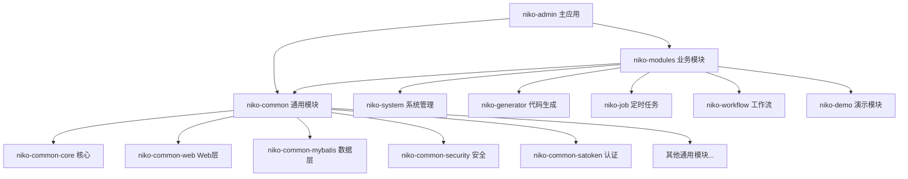

# Niko-Admin 后端模块深度分析

## 📦 模块总览

Niko-Admin 后端采用**模块化架构设计**，分为三大模块组：
- **niko-admin**: 主应用模块 (1个)
- **niko-common**: 通用功能模块 (17个)
- **niko-modules**: 业务功能模块 (5个)

## 🏗️ 模块依赖关系图



## 🎯 主应用模块 (niko-admin)

### 核心职责
- 🚀 **应用启动**: Spring Boot 应用的入口点
- 🌐 **Web配置**: 全局Web配置和异常处理
- 🔐 **认证服务**: 登录、注册、验证码等认证功能
- 📋 **基础接口**: 首页、个人中心等基础接口

### 重要性评级: ⭐⭐⭐⭐⭐ (核心)
**绝对不能删除** - 这是整个应用的启动入口和核心配置

### 关键文件分析
```java
org.niko.NikoApplication.java           // 🚀 Spring Boot 启动类
org.niko.web.controller.AuthController  // 🔐 认证控制器
org.niko.web.service.SysLoginService    // 🔑 登录服务实现
```

### 模块特点
- **轻量级设计**: 只包含启动和认证相关代码
- **策略模式**: 支持多种登录方式(密码、短信、邮箱、社交登录)
- **多租户支持**: 登录时自动处理租户切换

---

## 📚 通用模块详细分析 (niko-common)

### 1. niko-common-core (核心基础)
**重要性**: ⭐⭐⭐⭐⭐ (核心 - 绝对不能删除)

#### 核心功能
- 🔧 **工具类集合**: 各种常用工具类和帮助方法
- 📏 **常量定义**: 系统级常量和枚举定义
- ⚠️ **异常处理**: 统一异常处理和自定义异常
- 🏗️ **基础模型**: Entity、VO、DTO等基础模型

#### 为什么核心
所有其他模块都依赖此模块的基础功能，删除会导致整个系统无法编译。

---

### 2. niko-common-web (Web层支持)
**重要性**: ⭐⭐⭐⭐⭐ (核心 - 绝对不能删除)

#### 核心功能
- 🌐 **Web配置**: 跨域、拦截器、过滤器配置
- 📝 **请求响应**: 统一请求响应格式处理
- 🔍 **参数验证**: 请求参数验证和转换
- 📊 **分页支持**: 统一分页参数处理

#### 删除影响
删除后所有Web接口将无法正常工作，系统完全无法提供HTTP服务。

---

### 3. niko-common-mybatis (数据访问层)
**重要性**: ⭐⭐⭐⭐⭐ (核心 - 绝对不能删除)

#### 核心功能
- 🗄️ **MyBatis配置**: MyBatis Plus全局配置
- 🔍 **数据权限**: 基于注解的数据权限控制
- 🏢 **多租户**: 多租户数据隔离实现
- 📊 **分页插件**: 自动分页功能

#### 关键特性
```java
@DataPermission(deptAlias = "d")  // 数据权限注解
@TenantIgnore                     // 租户忽略注解
```

---

### 4. niko-common-redis (缓存管理)
**重要性**: ⭐⭐⭐⭐⭐ (核心 - 绝对不能删除)

#### 核心功能
- 🔴 **Redis配置**: Redis连接池和序列化配置
- 💾 **缓存管理**: 统一缓存操作接口
- 🔒 **分布式锁**: 基于Redis的分布式锁实现
- 📊 **缓存监控**: 缓存使用情况监控

#### 删除影响
删除后系统无法使用缓存，性能严重下降，会话管理失效。

---

### 5. niko-common-satoken (权限认证)
**重要性**: ⭐⭐⭐⭐⭐ (核心 - 绝对不能删除)

#### 核心功能
- 🔐 **Sa-Token配置**: 权限认证框架配置
- 👤 **用户会话**: 用户登录状态管理
- 🛡️ **权限验证**: 接口和功能权限验证
- 🔑 **Token管理**: JWT Token生成和验证

#### 权限注解示例
```java
@SaCheckPermission("system:user:query")    // 权限检查
@SaCheckRole("admin")                       // 角色检查
@SaIgnore                                   // 忽略认证
```

---

### 6. niko-common-security (安全防护)
**重要性**: ⭐⭐⭐⭐ (重要 - 建议保留)

#### 核心功能
- 🛡️ **XSS防护**: 跨站脚本攻击防护
- 🔒 **SQL注入防护**: SQL注入攻击防护
- 🌐 **CORS配置**: 跨域请求配置
- 🔐 **密码加密**: 密码加密和验证

#### 可删除性评估
可以删除，但会失去重要的安全防护功能，不建议在生产环境删除。

---

### 7. niko-common-log (日志管理)
**重要性**: ⭐⭐⭐⭐ (重要 - 建议保留)

#### 核心功能
- 📝 **操作日志**: 用户操作行为记录
- 🎯 **切面实现**: 基于AOP的日志记录
- 📊 **日志分析**: 日志统计和分析
- 💾 **异步存储**: 异步日志存储提升性能

#### Log注解使用
```java
@Log(title = "用户管理", businessType = BusinessType.INSERT)
public void insertUser(SysUser user) { ... }
```

---

### 8. niko-common-excel (Excel处理)
**重要性**: ⭐⭐⭐ (可选 - 可根据需求删除)

#### 核心功能
- 📊 **Excel导入**: 支持大文件Excel数据导入
- 📈 **Excel导出**: 支持复杂格式Excel导出
- 🔄 **数据转换**: Excel数据与Java对象转换
- ✅ **数据验证**: 导入数据格式验证

#### 删除影响
删除后无法使用Excel导入导出功能，但不影响系统核心功能。

---

### 9. niko-common-oss (对象存储)
**重要性**: ⭐⭐⭐ (可选 - 可根据需求删除)

#### 核心功能
- 📎 **文件上传**: 支持多种存储方式(本地、MinIO、阿里云OSS等)
- 🖼️ **图片处理**: 图片压缩、裁剪、水印等
- 📁 **文件管理**: 文件的增删改查操作
- 🔗 **访问链接**: 生成文件访问链接

#### 存储支持
- Local (本地存储)
- MinIO (开源对象存储)
- 阿里云 OSS
- 腾讯云 COS
- 七牛云

---

### 10. niko-common-sms (短信服务)
**重要性**: ⭐⭐ (可选 - 可删除)

#### 核心功能
- 📱 **短信发送**: 支持多家短信服务商
- ✅ **验证码**: 短信验证码发送和验证
- 📊 **发送记录**: 短信发送历史记录
- ⚖️ **限流控制**: 短信发送频率限制

#### 支持服务商
- 阿里云短信
- 腾讯云短信
- 华为云短信
- 京东云短信

---

### 11. niko-common-mail (邮件服务)
**重要性**: ⭐⭐ (可选 - 可删除)

#### 核心功能
- 📧 **邮件发送**: HTML/文本邮件发送
- 📎 **附件支持**: 邮件附件处理
- 📝 **模板支持**: 邮件模板管理
- 📊 **发送记录**: 邮件发送历史

---

### 12. niko-common-encrypt (数据加密)
**重要性**: ⭐⭐⭐⭐ (重要 - 涉及数据安全)

#### 核心功能
- 🔒 **字段加密**: 数据库敏感字段自动加解密
- 🌐 **API加密**: 接口请求响应加解密
- 🔑 **多种算法**: 支持AES、RSA、SM2、SM4等加密算法
- 🏷️ **注解驱动**: 基于注解的加密配置

#### 加密注解
```java
@EncryptField(algorithm = EncryptAlgorithm.AES)
private String phone;  // 手机号自动加密存储
```

---

### 13. niko-common-sensitive (数据脱敏)
**重要性**: ⭐⭐⭐ (可选 - 但涉及数据安全)

#### 核心功能
- 🙈 **数据脱敏**: 敏感数据显示时自动脱敏
- 🏷️ **注解配置**: 基于注解的脱敏规则
- 🔧 **多种策略**: 支持手机号、身份证、邮箱等脱敏
- 🎯 **灵活配置**: 支持自定义脱敏规则

---

### 14. niko-common-tenant (多租户)
**重要性**: ⭐⭐⭐⭐⭐ (如果使用多租户则为核心)

#### 核心功能
- 🏢 **租户隔离**: 数据层面的租户隔离
- 🔄 **自动填充**: 自动填充租户ID
- 🎛️ **开关控制**: 支持开启/关闭多租户功能
- 🚫 **忽略机制**: 支持忽略租户隔离的表

#### 多租户注解
```java
@TenantIgnore  // 忽略租户隔离
public class SysMenu { ... }
```

---

### 15. niko-common-idempotent (幂等性)
**重要性**: ⭐⭐⭐ (可选 - 但提升系统稳定性)

#### 核心功能
- 🔄 **防重复提交**: 防止表单重复提交
- 🔑 **幂等键**: 基于幂等键的重复请求处理
- ⏰ **时间窗口**: 可配置的重复检测时间窗口
- 💾 **多种存储**: 支持Redis、内存等存储方式

---

### 16. niko-common-ratelimiter (限流控制)
**重要性**: ⭐⭐⭐ (可选 - 但提升系统稳定性)

#### 核心功能
- 🚦 **接口限流**: 基于注解的接口访问限流
- 👤 **用户限流**: 针对特定用户的限流
- 🌐 **IP限流**: 基于IP地址的限流
- 📊 **多种算法**: 令牌桶、滑动窗口等限流算法

---

### 17. 其他通用模块

#### niko-common-job (定时任务基础)
- **重要性**: ⭐⭐⭐ (可选)
- **功能**: 定时任务的基础配置和工具类

#### niko-common-social (社交登录)
- **重要性**: ⭐⭐ (可选)
- **功能**: 第三方社交平台登录支持

#### niko-common-sse (服务端推送)
- **重要性**: ⭐⭐ (可选)
- **功能**: Server-Sent Events 实现

#### niko-common-websocket (WebSocket)
- **重要性**: ⭐⭐ (可选)
- **功能**: WebSocket实时通信支持

---

## 📦 业务模块详细分析 (niko-modules)

### 1. niko-system (系统管理)
**重要性**: ⭐⭐⭐⭐⭐ (核心 - 绝对不能删除)

#### 核心功能
- 👥 **用户管理**: 用户的增删改查、角色分配
- 👤 **角色管理**: 角色定义、权限分配
- 📋 **菜单管理**: 系统菜单和权限配置
- 🏢 **部门管理**: 组织架构管理
- 💼 **岗位管理**: 岗位定义和分配
- 📚 **字典管理**: 系统字典数据管理
- ⚙️ **参数配置**: 系统参数配置管理
- 📢 **通知公告**: 系统公告管理
- 🏢 **租户管理**: 多租户相关管理功能

#### 模块结构
```
niko-system/
├── controller/     # 控制器层
│   ├── system/     # 系统管理控制器
│   └── monitor/    # 监控管理控制器
├── service/        # 服务层
├── domain/         # 实体层
│   ├── bo/         # 业务对象
│   └── vo/         # 视图对象
└── mapper/         # 数据访问层
```

#### 删除影响
这是系统的核心业务模块，删除后整个后台管理功能将完全失效。

---

### 2. niko-generator (代码生成器)
**重要性**: ⭐⭐⭐ (可选 - 开发辅助工具)

#### 核心功能
- 🏭 **代码生成**: 根据数据库表自动生成代码
- 📝 **模板管理**: 支持多种代码模板
- ⚙️ **配置管理**: 生成代码的各项配置
- 👀 **代码预览**: 生成前可预览代码
- 📦 **批量生成**: 支持批量生成多个表

#### 支持生成内容
- Entity (实体类)
- Mapper (数据访问层)
- Service (服务层)
- Controller (控制器层)
- Vue页面和API

#### 删除影响
删除后无法使用代码生成功能，但不影响已生成的代码运行。

---

### 3. niko-job (定时任务)
**重要性**: ⭐⭐⭐ (可选 - 根据业务需求)


#### 核心功能
- ⏰ **任务调度**: 定时任务的创建和管理
- 📊 **执行监控**: 任务执行状态监控
- 📝 **执行日志**: 任务执行历史记录
- 🔄 **任务控制**: 任务的启动、停止、暂停

#### 删除影响
删除后无法使用定时任务功能，如果业务不需要定时任务可以安全删除。

---

### 4. niko-workflow (工作流)
**重要性**: ⭐⭐⭐⭐ (重要 - 如果需要审批流程)

#### 核心功能
- 🎨 **流程设计**: 可视化流程设计器
- 📋 **流程管理**: 流程定义、部署、版本管理
- 📄 **实例管理**: 流程实例的创建和监控
- ✅ **任务处理**: 待办任务、已办任务管理
- 📊 **流程监控**: 流程执行统计和分析

#### 基于技术
- **Warm-Flow**: 国产开源工作流引擎
- **流程设计器**: 基于Web的可视化设计器

#### 删除影响
删除后无法使用工作流功能，如果业务不需要审批流程可以删除。

---

### 5. niko-demo (演示模块)
**重要性**: ⭐ (可选 - 纯演示用途)

#### 核心功能
- 🎪 **功能演示**: 展示系统各种功能的使用方法
- 📚 **示例代码**: 提供开发参考示例
- 🧪 **测试数据**: 测试功能用的示例数据

#### 删除影响
完全可以删除，不会对系统功能产生任何影响。建议在生产环境中删除。

---

## 🎯 模块重要性总结

### 🔴 核心模块 (绝对不能删除)
- niko-admin (主应用)
- niko-common-core (核心基础)
- niko-common-web (Web支持)
- niko-common-mybatis (数据访问)
- niko-common-redis (缓存)
- niko-common-satoken (认证)
- niko-system (系统管理)

### 🟡 重要模块 (建议保留)
- niko-common-security (安全防护)
- niko-common-log (日志管理)
- niko-common-encrypt (数据加密)
- niko-common-tenant (多租户)
- niko-workflow (工作流)

### 🟢 可选模块 (根据需求决定)
- niko-common-excel (Excel处理)
- niko-common-oss (对象存储)
- niko-common-sensitive (数据脱敏)
- niko-common-idempotent (幂等性)
- niko-common-ratelimiter (限流)
- niko-generator (代码生成)
- niko-job (定时任务)

### ⚪ 可删除模块
- niko-common-sms (短信服务)
- niko-common-mail (邮件服务)
- niko-common-social (社交登录)
- niko-common-sse (服务端推送)
- niko-common-websocket (WebSocket)
- niko-demo (演示模块)

## 🔗 模块间依赖关系

### 依赖层次结构
```
Level 1: niko-admin (应用层)
    ↓
Level 2: niko-modules (业务层)
    ↓
Level 3: niko-common (通用层)
    ↓
Level 4: Third-party Libraries (第三方库)
```

### 循环依赖检查
✅ **无循环依赖** - 项目采用清晰的层次结构，避免了循环依赖问题

## 🚀 性能和扩展性考虑

### 性能优化
- **缓存策略**: Redis缓存减少数据库访问
- **连接池**: 数据库连接池优化
- **异步处理**: 日志异步写入提升性能
- **分页查询**: 大数据量分页处理

### 扩展性设计
- **插件化架构**: 模块间低耦合设计
- **配置驱动**: 通过配置文件控制功能开关
- **多数据源**: 支持读写分离和多数据库
- **水平扩展**: 支持集群部署

---

> 📝 **说明**: 这是 Niko-Admin 后端模块的详细分析，包含了所有模块的功能说明和重要性评级。
> 📖 **下一步**: 查看 `niko-admin-frontend-analysis.md` 了解前端架构的详细分析。